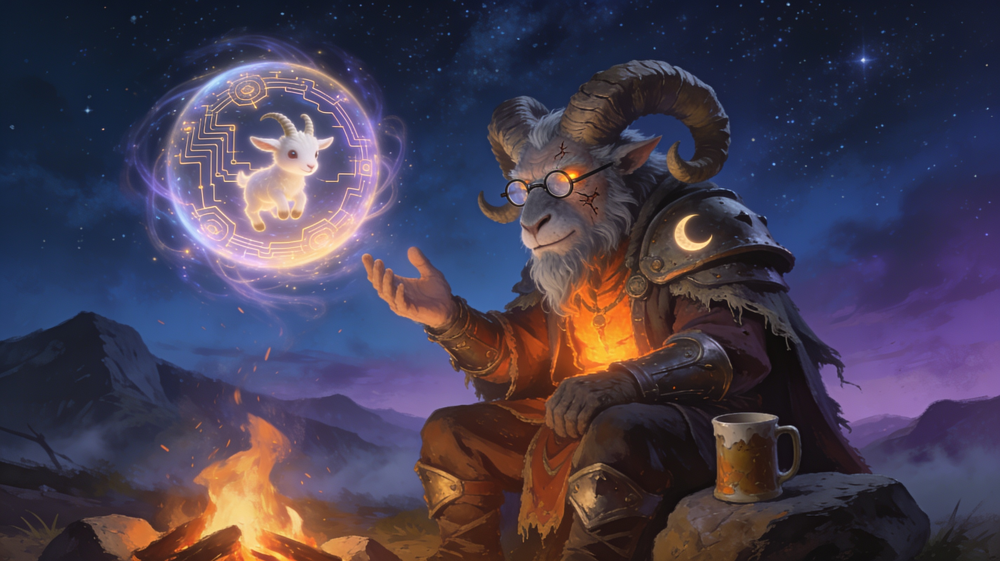
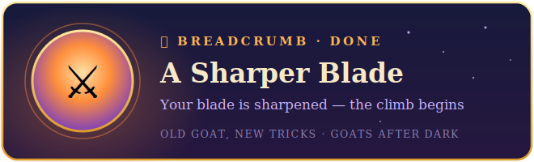
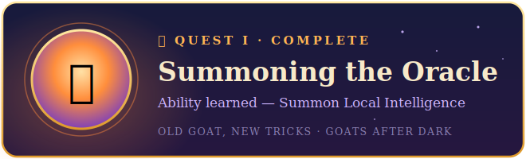
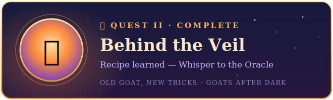
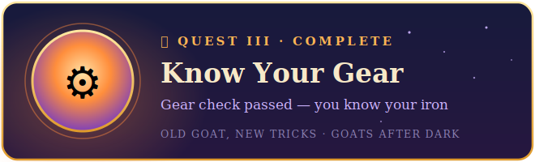
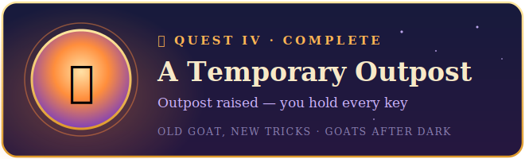
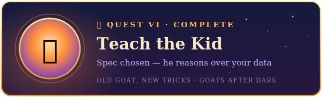

# Old Goat, New Tricks

### A 7-quest attunement: stand up your own local AI, then bind it to a Discord you control.

For the goats of **Goats After Dark** — ex-hardcore raiders who left the grind but kept the muscle memory.

You've fed your character to SimulationCraft. You've read parses on Warcraft Logs. This is the **same loop** — data in, engine runs, data out — except this time *you own the engine*. It runs on your own rig, offline and free, and you can point it at anything: your logs, your portfolio, your fantasy roster, whatever you want.

No prior command-line experience required. If you ever edited `autoexec.bat` to free up conventional memory for a DOS game, you've already done something harder than this. Welcome back to the command line.

> **The one rule:** every step is here for a reason, like a raid mechanic. Don't skip one or you'll wipe. Read the tooltip, run the command, check the objective, move on. We don't skip mechanics.

---

## 📥 How to follow this

Read the whole questline **right here on GitHub** — Quests 0–4 are commands you type and buttons you click, with nothing to download.

**From Quest 5 onward, you'll run two small files from this repo on your own PC.** Grab them whenever — now, or when you reach Quest 5:

1. Click the green **`<> Code`** button at the top of the repo → **Download ZIP**.
2. **Right-click the downloaded ZIP → Properties → tick "Unblock" (bottom) → OK.** *(Windows flags anything from the internet; this one checkbox clears it so the helper files run without nagging you later.)*
3. Open the ZIP and **Extract** it somewhere easy, like your **Desktop**.
4. You'll get a folder named **`llmquest-main`** — everything you need is in the **`bot`** folder inside it.

*No `git` required. (If you already live in `git clone`, that works too.)*

---

## The chain

You don't have to clear it in one night. Quests persist in your log — park it after a pull, come back tomorrow.

| # | Quest | What you do | Reward |
|---|-------|-------------|--------|
| 🍞 | [**A Sharper Blade**](quests/quest-00-breadcrumb-a-sharper-blade.md) | install a proper terminal | *none — a breadcrumb just points you at the hub* |
| 1 | [**Summoning the Oracle**](quests/quest-01-summoning-the-oracle.md) | install Ollama, speak to a model on your own machine | learn **Summon Local Intelligence** |
| 2 | [**Behind the Veil**](quests/quest-02-behind-the-veil.md) | discover it was a server all along; send data in, read it out | recipe: **Whisper to the Oracle** |
| 3 | [**Know Your Gear**](quests/quest-03-know-your-gear.md) | the VRAM check — which models your rig can pull | *gear check (no payoff, on purpose)* |
| 4 | [**A Temporary Outpost**](quests/quest-04-a-temporary-outpost.md) | join the guild's shared sandbox server — your keys come with the invite | the keys to the outpost |
| 5 | [**Bind a Familiar**](quests/quest-05-bind-a-familiar.md) | raise **the Kid** — a Discord bot — and bind it to your outpost | a familiar answers to you |
| 6 | [**Teach the Kid**](quests/quest-06-teach-the-kid.md) | feed it your data — hero example: a raid pull, analyzed | **choose your spec** |
| 7 | [**Attuned**](quests/quest-07-attuned.md) | keep him alive; point the same machine at anything | **title: the Greatest of All Time** |

---

## The two things you already know that make this easy

- **SimulationCraft** — you paste your character in, a black box runs, numbers come out, you optimize. **Ollama is SimC for words.** Same shape; you own the engine and can aim it anywhere.
- **Warcraft Logs** — combat log in, parse out. **Ollama + your logs is a private WCL you can actually *ask*** — "why did we wipe on pull 14," not just a number on a chart.

That's the whole demystification. Everything in the quests is just plumbing those two ideas into your machine and your Discord.

## What's in this repo

```
quests/     the breadcrumb + 7 quests, in order — start here
bot/        the Kid — a ready-to-run Discord bot (bot.py). You edit two lines, you don't write it.
examples/   analyze-a-pull.py — feed one raid pull to the model and ask why you wiped
data/       a sample parse summary to practice on (swap in your own)
```

The bot reads its secret token from `bot/.env`, which is **gitignored** — your token never lives in this repo. Copy `bot/.env.example` to `bot/.env` and paste your own in (Quest 5 walks you through it).

## Requirements

- Windows 10 or 11
- An NVIDIA graphics card (any modern one runs the starter model, `llama3.2`)
- A free web AI open in your browser as a copilot — ChatGPT, Gemini, or Claude (claude.ai). You'll `/whisper` it when you're stuck.

---

## 🏆 The Trophy Wall

Every quest you clear drops a **Ding** — screenshot it and post it to the guild's `#ding-board`. Collect the set:

<table>
<tr>
<td></td>
<td></td>
</tr>
<tr>
<td></td>
<td></td>
</tr>
<tr>
<td></td>
<td></td>
</tr>
<tr>
<td></td>
<td></td>
</tr>
</table>

---

## ▶ Start here

**[🍞 Breadcrumb — A Sharper Blade](quests/quest-00-breadcrumb-a-sharper-blade.md)** — three minutes, then the real questline begins.

*When you finish, post your proudest **Ding** — the Kid saying something sharp about your own data — and claim the title.*
