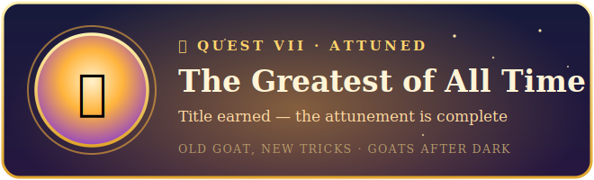

❗ **Quest 7 of 7 — Attuned**
*Quest line: Old Goat, New Tricks*

> *The old goat finally smiles. "You summoned a mind, found the server behind the veil, learned your gear, raised a hall, bound a familiar, and taught it your trade. You're attuned now. The rest is yours to write."*

**Requires:** Quests 1–6.
**Time:** as long as you want.
**Reward:** the title **the Greatest of All Time.**

---

### 1. Keep the Kid awake

Right now the Kid lives only while his terminal window is open. Three ways to keep him up, easiest first:

- **Just leave the window open.** On an always-on desktop this is genuinely fine — minimize it and forget it.
- **Start him on login.** Press **Win+R**, type `shell:startup`, Enter. Drop a shortcut in that folder that runs `py "D:\path\to\bot\bot.py"`. Now he wakes when you log in.
- **Park him on always-on iron.** A spare PC, a mini-PC, or a Raspberry Pi running Ollama + the bot, on 24/7. This is the "real" answer — and a fun project that's the doorway to the next questline.

> **Tooltip — the honest truth:** he needs *something* running Ollama and the bot, powered on. There's no free always-on; there's only "whose machine, and when." Pick what fits your life.

### 2. Where the road goes

You have the substrate now. Here's what it grows into — each one a continuation of this story, if things go well:

- **A sharper Kid** — if your gear allows, pull a bigger model (Quest 3) and change one line in `.env`.
- **Steering** — *prompt engineering*: how you ask changes everything. Ask the Kid for a story, then change *how* you ask and watch it transform.
- **Memory** — *context management*: feeding the right slice, summarizing the rest, so the conversation doesn't fall off the edge.
- **Real retrieval** — when your data outgrows a single file, that's *RAG*: the Kid looks things up before he answers. A questline of its own.
- **Your web-AI as copilot** — keep pasting errors and asking "how do I make the Kid do X." You've been doing it the whole time.

### 3. Claim your title

Post your proudest **Ding** to the **#ding-board** — the Kid saying something genuinely sharp about *your* data. That's the turn-in.

---

🏆 **Attunement Complete: Old Goat, New Tricks**

*You have earned the title:* **`<YourName>`, the Greatest of All Time.**

> *Few summon an oracle of their own. Fewer still do it after the kids are asleep.*

You run a local mind, on your own iron, bound to your own hall, speaking in your voice, about your world — and it cost you nothing but a few good nights. That's the whole trick.

Welcome to *Goats After Dark*, G.O.A.T.

*— The end of the beginning. The next questline starts the day the #ding-board says it should.*

---

  
   
  <em>🏆 You're a G.O.A.T. Post your final Ding in <code>#ding-board</code> and claim the title.</em>

